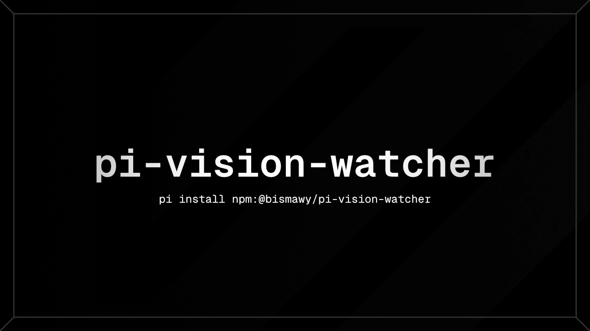

# 👁️ @bismawy/pi-vision-watcher

**Give text-only [pi](https://github.com/earendil-works/pi-coding-agent) models vision capabilities.**

Seamlessly inspect, describe, and convert visual inputs (screenshots, mockups, terminal errors, clipboard pastes) into structured descriptions using your preferred vision model, and hand them off to text-only coding models without interrupting your workflow.

[](https://github.com/earendil-works/pi-coding-agent)
[](https://www.npmjs.com/package/@bismawy/pi-vision-watcher)
[](./LICENSE)



---

## ⚡ Quick Start

### 1. Installation
```bash
pi install npm:@bismawy/pi-vision-watcher
```
*(Or install directly from Git: `pi install git:github.com/bismawy/pi-vision-watcher`)*

### 2. Select Vision Model
Open the interactive TUI selector to choose your vision describer model from your connected providers:
```bash
/vision-watcher
```
*(You can also set it directly: `/vision-watcher model openai/gpt-4o`)*

### 3. Work Seamlessly
Switch to any text-only model in Pi (e.g. DeepSeek, Claude text-only, local models). Whenever you paste an image, attach a file, or the agent runs `read` on an image, `pi-vision-watcher` describes it automatically in the background.

---

## 🚀 Key Capabilities

- 🎯 **Connected-Only Interactive Picker:** Shows only vision-capable models from providers where you actually have active credentials (`/login`, `models.json`, or environment variables).
- ⚡ **DataLoader Batching & SHA-256 Cache:** Automatically groups multiple images across parallel tool calls or multi-file prompts into a single batched describer request. Cached images are never re-described.
- 🛡️ **Proactive False-Vision Healing:** Aggregator providers often mistakenly flag models (like DeepSeek V4) as multimodal, causing HTTP 400 errors (`This model does not support image`). `pi-vision-watcher` proactively forces handoff for these models and auto-heals `models.json` `modelOverrides` in-process.
- 🧠 **Thinking & Reasoning Controls:** Adjust reasoning levels (`off`, `minimal`, `low`, `medium`, `high`, `xhigh`, `max`) for reasoning-capable vision models (o-series, Claude, DeepSeek).
- 🔄 **Multi-Model Fallback Chains:** Automatically falls back to backup vision models if your primary provider is rate-limited or unavailable.

---

## 🕹️ Command Reference

| Command | Action |
|---|---|
| `/vision-watcher` | Open interactive TUI picker for connected vision models |
| `/vision-watcher model <provider/id>` | Set primary vision describer directly |
| `/vision-watcher status` | View current configuration and active model status |
| `/vision-watcher auto <on\|off>` | Toggle automatic handoff for non-vision models (default: `on`) |
| `/vision-watcher add <provider/id>` | Force handoff on a specific model |
| `/vision-watcher remove <provider/id>` | Remove model from forced handoff list |
| `/vision-watcher thinking <level>` | Configure reasoning effort for vision models |
| `/vision-watcher enable` / `disable` | Toggle extension active state |
| `/vision-watcher help` | Show in-CLI command documentation |

---

## 📖 Deep Dive & Advanced Configuration

<details>
<summary><b>⚙️ Configuration File Schema (<code>pi-vision-watcher.json</code>)</b></summary>

Configuration is stored at `~/.pi/agent/extensions/pi-vision-watcher.json`:

```json
{
  "enabled": true,
  "visionModel": "openai/gpt-4o",
  "fallbackModels": [],
  "autoHandoff": true,
  "handoffModels": [],
  "thinking": false,
  "thinkingLevel": "medium",
  "describeTimeoutMs": 45000,
  "prewarmPastedImages": false,
  "asyncClipboardHandoff": false,
  "maxTokens": null,
  "cacheMax": 50,
  "maxDescriptionLines": 0
}
```

| Field | Type | Default | Description |
|---|---|---|---|
| `enabled` | `boolean` | `true` | Master switch for handoff processing. |
| `visionModel` | `string \| null` | `null` | Primary describer model ref (`provider/id`). |
| `fallbackModels` | `string[]` | `[]` | Ordered backup models if the primary model fails. |
| `autoHandoff` | `boolean` | `true` | Automatically describe images for models lacking native vision. |
| `handoffModels` | `string[]` | `[]` | Specific model IDs forced to receive descriptions. |
| `thinking` | `boolean` | `false` | Enable reasoning tokens for vision model. |
| `thinkingLevel` | `string` | `"medium"` | Reasoning effort (`minimal`, `low`, `medium`, `high`, `xhigh`, `max`). |
| `describeTimeoutMs` | `number` | `45000` | Per-batch timeout before aborting or triggering fallbacks. |
| `prewarmPastedImages` | `boolean` | `false` | Start describing clipboard images immediately upon pasting in prompt. |
| `asyncClipboardHandoff` | `boolean` | `false` | Async clipboard injection fallback mechanism. |
| `maxTokens` | `number \| null` | `null` | Max output tokens for descriptions (`null` = model default). |
| `cacheMax` | `number` | `50` | Maximum cached image hashes per session. |
| `maxDescriptionLines` | `number` | `0` | Truncate lines in description block (`0` = full description). |

</details>

<details>
<summary><b>🔍 Troubleshooting, Recovery & Diagnostics</b></summary>

### Structured Error Logging
If a vision call fails, errors are appended with stack traces and request metadata to:
```text
~/.pi/agent/logs/pi-vision-watcher/errors.log
```
Failures degrade gracefully to `[Image: description unavailable]` without breaking the agent turn.

### False-Vision Auto-Recovery
When a model falsely advertises image capability and returns an HTTP 400 rejection:
1. `pi-vision-watcher` captures the error in the `message_end` event.
2. It automatically updates `~/.pi/agent/models.json` under `providers.<name>.modelOverrides.<model>.input = ["text"]`.
3. It triggers an in-process registry refresh so subsequent turns use handoff naturally.

</details>

<details>
<summary><b>🛠️ Development & Testing</b></summary>

```bash
bun install
bun run test          # Run Vitest test suite (240+ unit tests)
bun run typecheck     # Run TypeScript compiler check
bun run lint:dead     # Scan for unused exports with Knip
```

</details>

---

## 📜 License & Acknowledgments

- Built for the **[pi coding agent](https://github.com/earendil-works/pi-coding-agent)** ecosystem.
- Evolved from concepts in `pi-vision-handoff` by Tom X Nguyen and `pi-umans-provider`.
- Distributed under the **[MIT License](./LICENSE)**.
